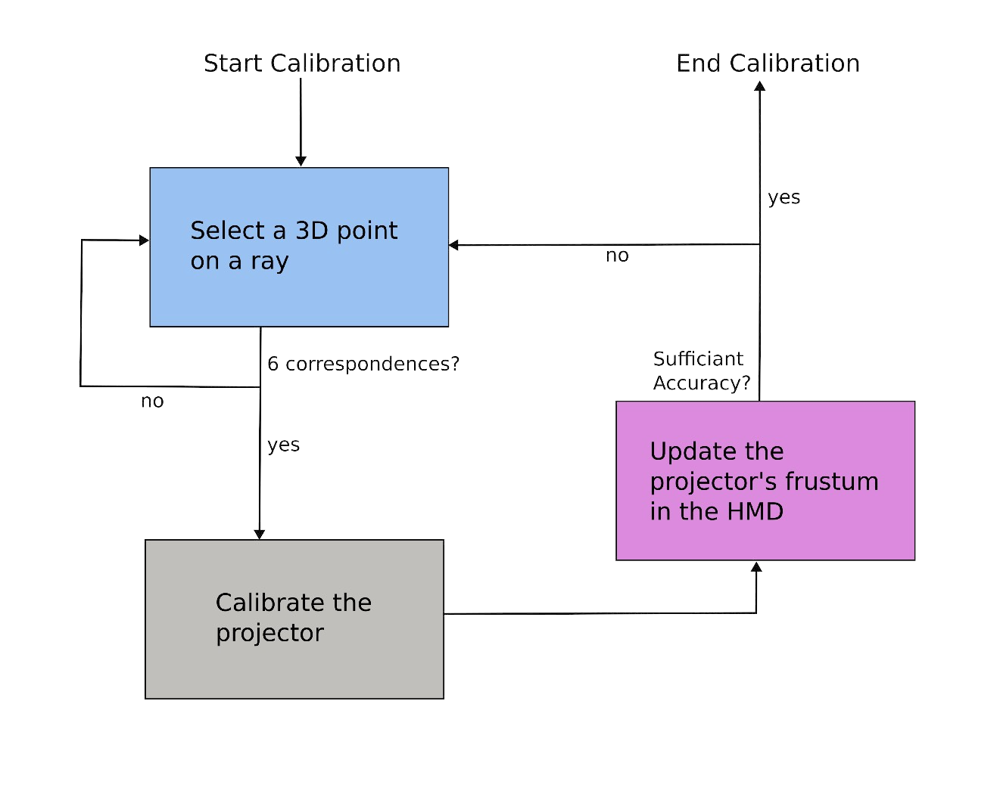

# Projector Calibration & Rendering for Dynamic Spatial Projection Mapping

This fork contains additions to [InACTually Engine](https://github.com/InACTually/InACTually-Engine) that got merged into upstream with [PR #1](https://github.com/InACTually/InACTually-Engine/pull/1). 
**They where created as part of my Bachelor Thesis.** All changes can be viewed [here](https://github.com/maantho/InACTually-Engine/tree/ProjectorCalibration)

The goal was to find a projector calibration method, that can be used for dynamic spatial projection mapping in a wide variety of artistic contexts. Out of existing methods a novel multi-projector calibration method was developed to support projection-mapping onto arbitrary dynamic surfaces. This is achieved in a user-friendly way, utilizing a mixed reality headset. It mitigates restriction on the surface and calibration targets, that are common with other projector calibration methods. 

To calibrate the projector with an MR headset, the user freely selects 3D world points that correspond to a set of projected
2D image points. The user intersects their hand with the ray formed by a projected
point. The hand position and the 2D image position are used as a correspondence to calibrate the projector with the
DLT algorithm. Repeating this interaction a minimum of six times produces a coarse
projector calibration. Multiple projectors can be calibrated in row, without requiring a specific surface or calibration target.
The DLT algorithm was implemented in C++. The projected image is rendered and mapped accurately to a surface by constructing an OpenGL projection matrix from the estimated parameters.

The estimated frustum and projector position and orientation can be inspected through the MR headset, creating the calibration flow shown below. Additionally, hand gesture recognition was added to enable the selection of points and placement of the world anchor with the corresponding hand gesture.  
The UI was created with WebGL and Three.js in this [fork](https://github.com/maantho/InACTually-Stage) and was merged in this [PR](https://github.com/InACTually/InACTually-Stage/pull/1).

The communication between the headset and the PC running the application over the network was handled by [InACTually](https://github.com/InACTually)
___

 
 
 

# InACTually Engine 

a MediaServer for driving all technology in\
interactive theater for actual acts

<https://github.com/InACTually/InACTually-Engine>

InACTually is (or wants to be) an artistic tool and consists of the Engine and the Stage. InACTually allows artists to realize their multimedia and multimodal concepts autonomously. The underlying spatiality of performing arts is used to design an intuitive and easy-to-use interface, which introduces direct manipulation as well as immersive applications in Mixed Reality.
