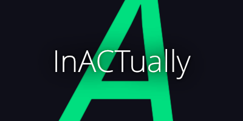
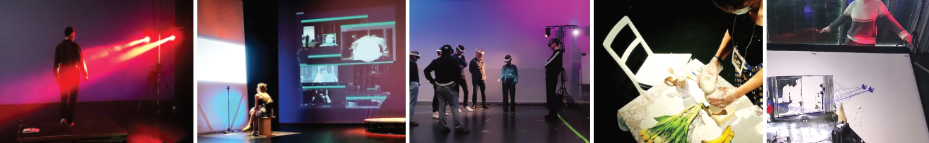

# InACTually Engine
a MediaServer for driving all technology in\
interactive theater for actual acts

InACTually is (or wants to be) an artistic tool and consists of the Engine and the Stage. InACTually allows artists to realize their multimedia and multimodal concepts autonomously. The underlying spatiality of performing arts is used to design an intuitive and easy-to-use interface, which introduces direct manipulation as well as immersive applications in Mixed Reality.

 

## 🎢 What InACTually actually is
... or what it wants to be.
We should definitively path this out.

InACTually started 2021 as tiny tool made by Lars Engeln and Fabian Töpfer that suits their needs to create spatial media installations and interactive moments in theater productions. So it got bigger and bigger over time, sometimes without really any time to refurbish. Thereby, some parts might be a bit deprecated, but we are tidying up :)

The Engine is InACTually's media server, that should be able to run a show or media installations on its own. Its core idea is to think everything spatially. Thereby, it has RoomNodes that express something in space like devices or tracked objects. According to that, there are ProcessingNode, which can be used to orchestrate more complex behaviour in the node-link diagram. 

[The Stage](https://github.com/InACTually/InACTually-Stage) (in another repo) is InACTually's frontend, that should be nicer to use and should only give instructions to the Engine what to do. The Stage is meant to be hosted in a venue, to easily access it via a tablet or a Mixed-Reality headset.

 

## 🎭 Gallery

We would like to build up a Gallery to showcase how InACTually is been used in all the lovely projects. Please contact us, if you use InACTually (all tools or one of them) in your projects.
And think about to contribute to the Gallery. \
Some impressions from projects by Fabian Töpfer and Lars Engeln using InACTually:

 

## 🛠️ Setup – How to compile

To make it compile... pray.
At the moment, only a project file for VisualStudio2022 is available.
A CMake workflow would be a dream.
Most of the dependencies are included in this repo (see the third-party notice below), but you need to setup the bigger dependencies yourself:

+ [Cinder - 0.9.3dev](https://github.com/cinder/Cinder) [Jul'25] (or possibly newer) \
Place Cinder in a folder named "Cinder" parallel to your InACTually-Engine folder (same hierarchy level), so that it can be relatively found. You need to replace the ImGui files with its [docking-branch](https://github.com/ocornut/imgui/tree/docking) [Jul'25]. After that, your want to compile Cinder with dynamic runtime linking (in VisualStudio something like: Proj.-settings -> C/C++ -> CodeGeneration -> runtime lib -> "-DLL"):
    - for Release "Multithreaded-DLL (/MD)" name the lib "cinder_MD.lib"
    - for Debug "Multithreaded-Debug-DLL (/MDd)" name the lib "cinder_MDd.lib" likewise

+ [OpenCV 4.10.0](https://github.com/opencv/opencv) (or possibly newer) \
You need to compile OpenCV, maybe with opencv_contrib and things you like to have.\
Place OpenCV in `./3rd/OpenCV4` – care the include folder is `./3rd/OpenCV4/include/opencv`.\
You need to place/copy the corresponding *.dll's in `vc2022\bin\Release|Debug`.

 

## ✒️ Contributing
Whether you are fixing a bug, suggesting an improvement, or just asking a question, you are helping make this better. Best is always to contact us, but you find more information in the [CONTRIBUTING.md](CONTRIBUTING.md).

 

## 🧩 Third-Party Notice and Credits

The InACTually Engine project uses external resources licensed under open-source terms. \
You can find the list of frameworks, code snippets, models, and other material in the [THIRD_PARTY.md](THIRD_PARTY.md).

 

## 📜 License
The InACTually Engine is licensed under the MIT License, see the [LICENSE](LICENSE). \
Contact us, if you use InACTually (all tools or one of them) in your projects. 
Would be nice to see, what lovely things you are creating :)